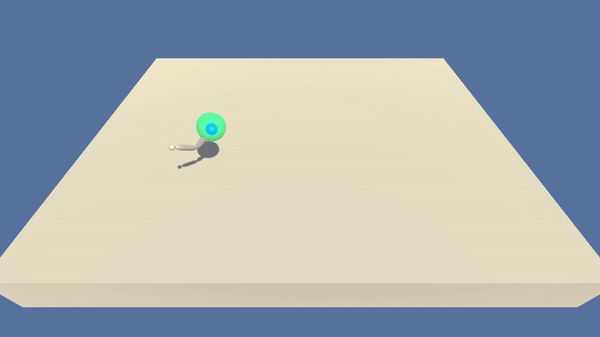

# Project 2: Continuous Control

### Introduction

This project is based on the [Reacher](https://github.com/Unity-Technologies/ml-agents/blob/master/docs/Learning-Environment-Examples.md#reacher) environment.




In this environment, a double-jointed arm can move to target locations. A reward of +0.1 is provided 
for each step that the agent's hand is in the goal location. Thus, the goal of your agent is to 
maintain its position at the target location for as many time steps as possible.

The observation space consists of 33 variables corresponding to position, rotation, velocity, and 
angular velocities of the arm. Each action is a vector with four numbers, corresponding to 
torque applicable to two joints. Every entry in the action vector should be a number between -1 and 1.

### Solving the Environment

For this project, we will work with both the single and multi agent environments. 

The task is episodic, and in order to consider the environment solved, the agent must get an average 
score of +30 over 100 consecutive episodes.

### Getting Started

1. Download the environments from one of the links below. 

##### Single Agent
- Linux: [click here](https://s3-us-west-1.amazonaws.com/udacity-drlnd/P2/Reacher/one_agent/Reacher_Linux.zip)
- Mac OSX: [click here](https://s3-us-west-1.amazonaws.com/udacity-drlnd/P2/Reacher/one_agent/Reacher.app.zip)
- Windows (32-bit): [click here](https://s3-us-west-1.amazonaws.com/udacity-drlnd/P2/Reacher/one_agent/Reacher_Windows_x86.zip)
- Windows (64-bit): [click here](https://s3-us-west-1.amazonaws.com/udacity-drlnd/P2/Reacher/one_agent/Reacher_Windows_x86_64.zip)

##### Multi Agent
- Linux: [click here](https://s3-us-west-1.amazonaws.com/udacity-drlnd/P2/Reacher/Reacher_Linux.zip)
- Mac OSX: [click here](https://s3-us-west-1.amazonaws.com/udacity-drlnd/P2/Reacher/Reacher.app.zip)
- Windows (32-bit): [click here](https://s3-us-west-1.amazonaws.com/udacity-drlnd/P2/Reacher/Reacher_Windows_x86.zip)
- Windows (64-bit): [click here](https://s3-us-west-1.amazonaws.com/udacity-drlnd/P2/Reacher/Reacher_Windows_x86_64.zip)


(_For Windows users_) Check out [this link](https://support.microsoft.com/en-us/help/827218/how-to-determine-whether-a-computer-is-running-a-32-bit-version-or-64) if you need help with determining if your computer is running a 32-bit version or 64-bit version of the Windows operating system.

(_For AWS_) If you'd like to train the agent on AWS (and have not [enabled a virtual screen](https://github.com/Unity-Technologies/ml-agents/blob/master/docs/Training-on-Amazon-Web-Service.md)), then please use [this link](https://s3-us-west-1.amazonaws.com/udacity-drlnd/P2/Reacher/one_agent/Reacher_Linux_NoVis.zip) (version 1) or [this link](https://s3-us-west-1.amazonaws.com/udacity-drlnd/P2/Reacher/Reacher_Linux_NoVis.zip) (version 2) to obtain the "headless" version of the environment.  You will **not** be able to watch the agent without enabling a virtual screen, but you will be able to train the agent.  (_To watch the agent, you should follow the instructions to [enable a virtual screen](https://github.com/Unity-Technologies/ml-agents/blob/master/docs/Training-on-Amazon-Web-Service.md), and then download the environment for the **Linux** operating system above._)

2. Unzip (or decompress) the file in the current folder. 

Save the path to the environment as it will be required in the notebook.

## Development setup

To run all the code available in this repo you need to install the following software:

* Python = 3.6 (other versions lead to compatibility issue)
* [poetry](https://python-poetry.org/) ≥ 1.0

### Poetry installation
To install and configure `poetry` run 
```shell script
curl -sSL https://raw.githubusercontent.com/python-poetry/poetry/master/get-poetry.py | python3
poetry config virtualenvs.in-project true
```

## Installation

First, to install all the required dependencies run
```shell script
poetry install
```

### Instructions

Follow the Solution notebooks for the [Single Agent](Solution_Single_agent.ipynb) and 
[Multi Agent](Solution_Multi_agent.ipynb) to see how the agent was trained and visualize the results

### Model

To solve the Reacher environment we implemented the DDPG algorithm. DDPG can be seen as an extension 
to continous domains of the DQN approach proposed by DeepMind. This model is based on an *Actor-Critic* 
approach 


In our case the Actor and the Critic are implemented as the following networks

##### Actor


##### Critic
